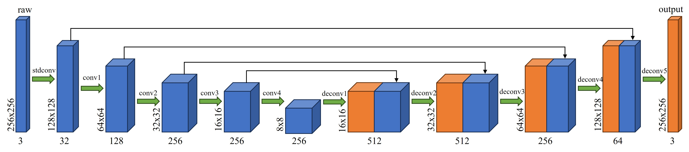

# Mobile-Water-Net

Official code of paper: (not yet pubilshed).


## Installation

```python
pip install -r requirements.txt
```


## Dataset


We used the [LSUI](https://lintaopeng.github.io/_pages/UIE%20Project%20Page.html) dataset to train the Mobile-Water-Net.  Please cite the paper:"U-shape Transformer for Underwater Image Enhancement"([U-Shape Transformer for Underwater Image Enhancement | IEEE Journals &amp; Magazine | IEEE Xplore](https://ieeexplore.ieee.org/abstract/document/10129222)) if you use the dataset.


## Model Architecture




The Mobile-Water-Net is a U-shape encoder-decoder network consist of five convolutional layers and five deconvolutional layers.  The stdconv is standard convolution layer and the conv1 to conv4 are depthwise separable convolution layers. The decoder of the Mobile-Water-Net utilizes feature-maps produced by the encoder to learn to generate a 256 $\times$ 256 $\times$ 3 image as output.


## Training


Please split the data into folder order including subfolder trainA, trainB.

* trainA: raw images for training.

* trainB: reference images corresponding to trainA.
  
  

```bash
python train.py --dataroot "./data/LSUI" --exp_name "exp1" --batch_size 24
```

For more parameters, plesae see the file "./options/train_options.py".


Checkpoint of the training will be save in the floder "./checkpoints/exp1".


## Testing

Our checkpoint is "./checkpoints/best.pth.tar"(No need to decompress this file).


```bash
python test.py --dataroot "./data/LSUI/testA" -m "./checkpoints/best.pth.tar" --save_path "./result/test_exp"
```


## Evaluation 
We evaluate our method by metrics including MSE, PSNR, SSIM, UIQM and UCIQE. The code of the metrics can be seen in the floder "./evaluation".

If you want to evaluate your results, we recommend you to use the jupyuter notebook file "./evaluation/processing.ipynb".

Source code of the metrics:
- UIQM: https://github.com/rowantseng/FUnIE-GAN-PyTorch/tree/master/evaluation
- UCIQE: https://github.com/JOU-UIP/UCIQE/

## Citing Mobile-Water-Net


```tex
not yet pubilshed
```

## License

The code is released under the [MIT license](./LICENSE)


